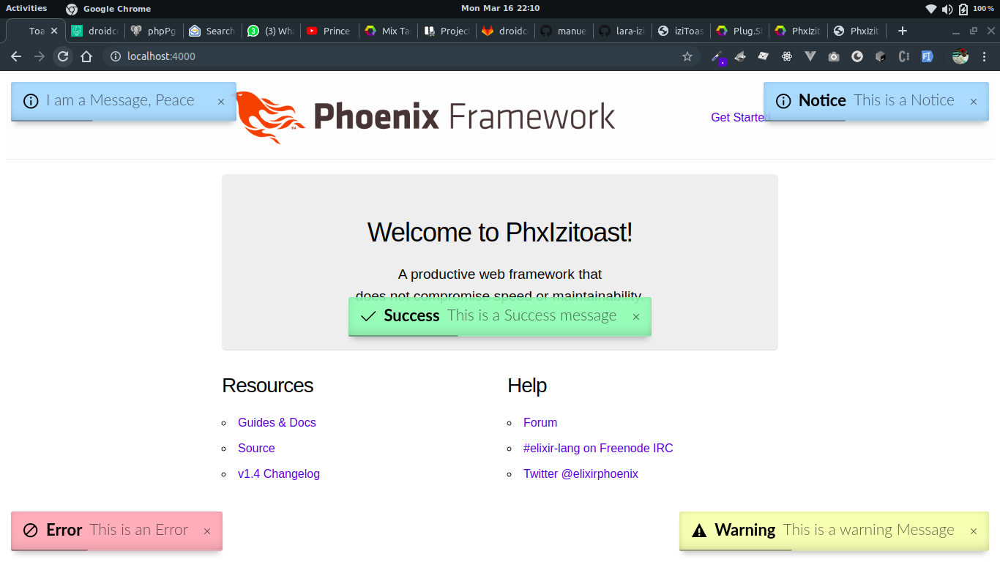

# Phx Izitoast -  Phoenix Notification package




This is a Phoenix Elixir IziToast Notification wrapper by [IziToast](https://izitoast.marcelodolza.com), A JavaScript Notifications Toast Library

**TODO: Add description**

## Installation

The package can be installed
by adding `phx_izitoast` to your list of dependencies in `mix.exs`:

```elixir
def deps do
  [
    {:phx_izitoast, "~> 0.1.1"}
  ]
end
```

## Configuration

Add the below config to `config/config.exs`. This includes the default configurations.  

```elixir
config :phx_izitoast, :opts, # bottomRight, bottomLeft, topRight, topLeft, topCenter, 
    position: "topRight", # dark,
    theme: "light",
    timeout: 5000,
    close: true,
    titleSize: 18,
    messageSize: 18,
    progressBar: true
```

Adding the JS Files to Layout  and Template. First import the Izitoast to your `layout_view.ex`
```elixir
import PhxIzitoast
```
Add the below function to the bottom of your `app.html.eex` just efore the closing `</body>` tag . This will import the needed  `css` and `js` files.
```elixir
<body>
...............
<%= izi_toast(@conn) %>
.................
</body>
```

Add the below code to your `app_web/endpoint.ex` file  just below the existing `plug Plug.Static` configuration.
```elixir 
plug Plug.Static, 
    at: "/", 
    from: {:phx_izitoast, "priv/static"}, 
    gzip: false, 
    only: ~w(css  js )
```
This adds the necessary js and css for iziToast

## Usage 
Quickest way to use PhxIzitoast

```elixir 
conn
|> PhxIzitoast.message("message")
```
or 
```elixir 
conn
|> PhxIzitoast.success("title", "message", opts // [])
|> PhxIzitoast.error("", "This is an Error message", [position: "center", timeout: 10000])
```
The title can be left to `""` to ignore the toast title


Usage in code would be like:

  ```elixir
  def create(conn, %{"category" => category_params}) do
    slug = slugified_title(category_params["name"])
    category_params = Map.put(category_params, "slug", slug)

    case Categories.create_category(category_params) do
      {:ok, _category} ->
        conn
        |> PhxIzitoast.success("Category", "Category created successfully")
        |> redirect(to: Routes.category_path(conn, :index))

      {:error, %Ecto.Changeset{} = changeset} ->
        conn 
        |> PhxIzitoast.error("Category", "A Validation Error !!!")
        |> render("new.html", changeset: changeset)
    end
  end
  ```

  WIth this you can remove the default notification alerts in `app.html.eex` and replace all your `put_flash/2` with `PhxIzitoast` .
        
### More functions include:

```elixir 
conn 
|> PhxIzitoast.success("title", "awesome", position: "bottomRight")
```

```elixir 
conn 
|> PhxIzitoast.success("title", "awesome")
```

```elixir 
conn 
|> PhxIzitoast.info("Success", "awesome", [position: "topRight"])
```

``` elixir 
conn 
|> PhxIzitoast.info("Hey", "This is Info")
```

```elixir 
conn 
|> PhxIzitoast.warning("title", "awesome", timeout: 1000)
```

```elixir 
conn 
|> PhxIzitoast.warning("title", "not very awesome")
```

```elixir 
conn 
|> PhxIzitoast.error("Arrow", "You've Failed this city", position: "bottomLeft")
```

```elixir 
conn 
|> PhxIzitoast.info("Error 500", "Error Occured !!!")
``` 

```elixir 
conn 
|> PhxIzitoast.clear_toast()
``` 

## Documentation 
 The docs can
be found at [https://hexdocs.pm/phx_izitoast](https://hexdocs.pm/phx_izitoast).

 ## Author 

[ManuEl Geek](https://manuel.appslab.co.ke)

## Contributing & Licence

Phx Izitoast is released under [MIT License](https://github.com/appcues/exsentry/blob/master/LICENSE.txt)


